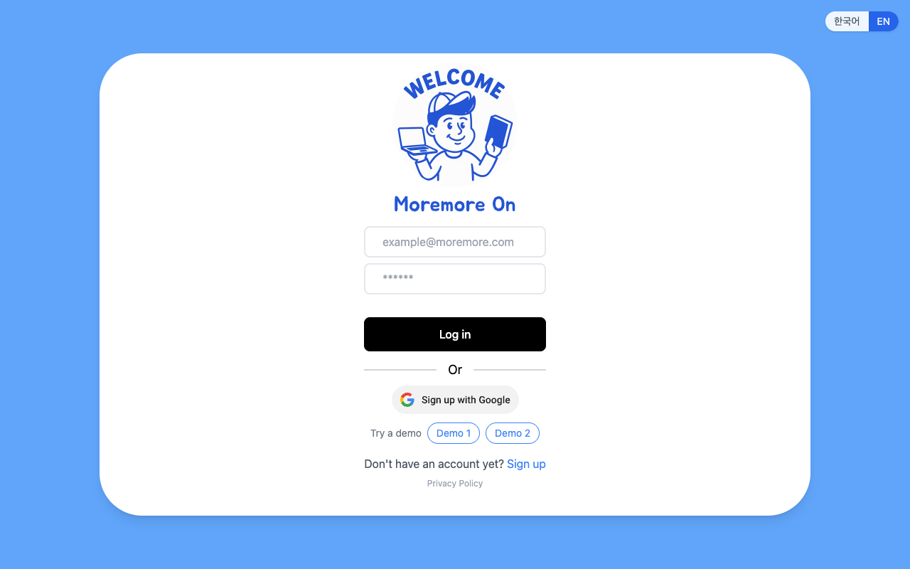
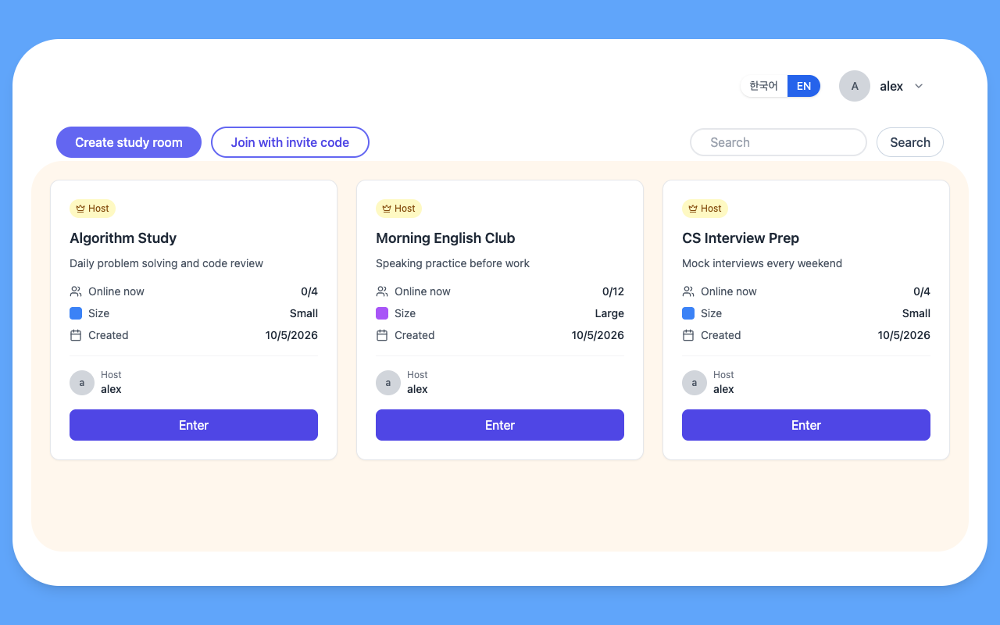
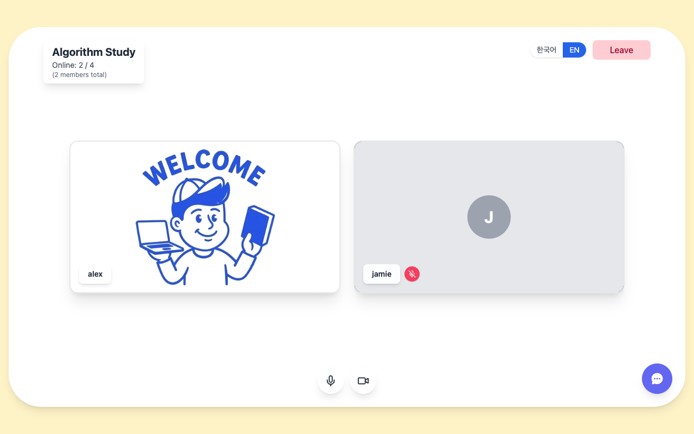
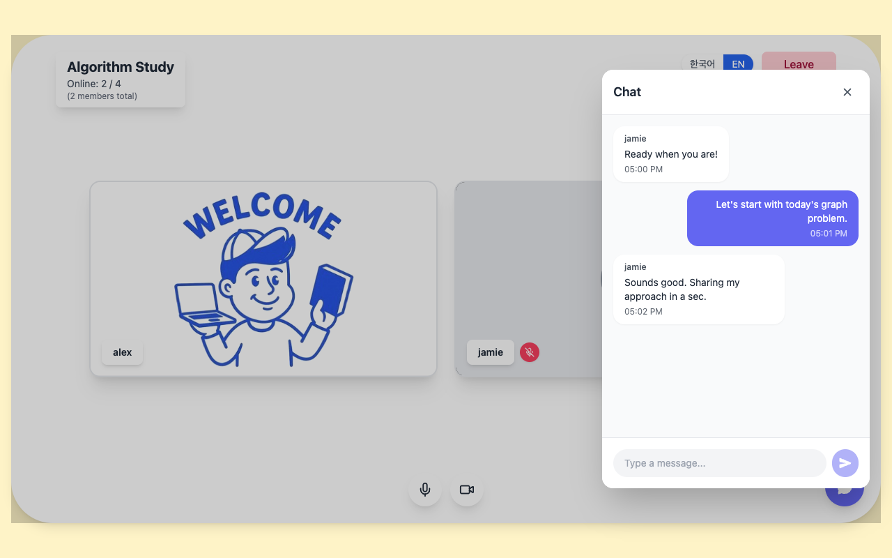
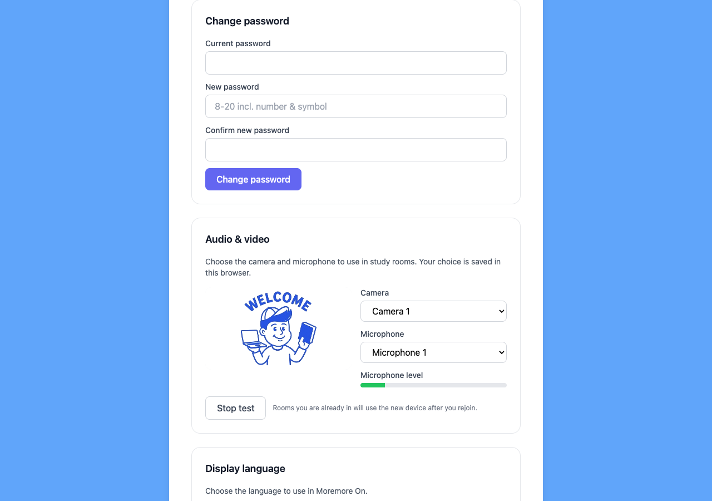
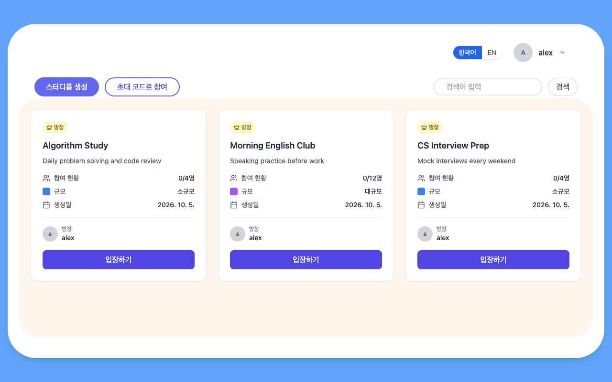
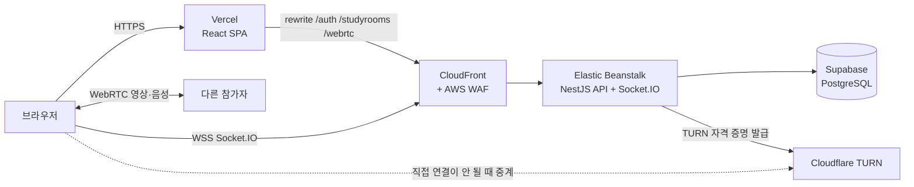

# 모어모어온 (Moremore On) — 프론트엔드

[English](README.md) | **한국어**

모어모어온은 화상·음성 스터디룸, 실시간 채팅, 초대 링크를 제공하는 그룹 스터디 서비스입니다. 이 저장소는 React 클라이언트이고, API는 [moremore-backend](https://github.com/HyeseongO/moremore-backend)에 있습니다.

**배포 주소:** https://moremore-frontend.vercel.app

가입 없이 로그인 화면의 **데모 1** 버튼으로 바로 체험할 수 있습니다. 통화를 시험하려면 데모 1로 방을 만들고 초대 링크를 복사한 뒤, 다른 브라우저(또는 시크릿 창)에서 **데모 2**로 로그인해 링크를 열어 보세요. 데모 계정은 설정에서 변경·탈퇴가 막혀 있어 누구나 계속 쓸 수 있습니다.



## 화면

| 스터디룸 목록 | 화상 스터디룸 |
| --- | --- |
|  |  |
| **채팅과 입력 중 표시** | **설정: 장치와 계정** |
|  |  |

서버 오류 문구까지 포함해 화면 전체를 한국어와 영어로 바꿀 수 있습니다.



## 주요 기능

- **계정**: 이메일 회원가입·구글 로그인, 로그아웃, 여러 기기 동시 로그인
- **스터디룸**: 방 만들기, 초대 링크·코드로 참여, 방장 표시, 실시간 접속자 수
- **화상·음성**: 소규모 방은 최대 4명 화상 통화, 대규모 방은 최대 12명 음성 통화
- **방 안 조작**: 마이크·카메라 켜기/끄기, 꺼짐 표시가 나중에 들어온 사람에게도 맞게 보임
- **채팅**: 메시지 저장, 입장 시 이전 대화 불러오기, 입력 중 표시, 언어에 맞는 시간 표시
- **설정**: 닉네임·비밀번호 변경, 회원 탈퇴, 카메라·마이크 선택과 미리보기·마이크 입력 막대
- **한국어·영어**: 브라우저 언어로 자동 선택, 어느 화면에서나 전환, 브라우저에 기억

## 구조



## 기술 스택

React 19 · TypeScript · Vite 7 · Tailwind CSS · React Router 7 · Socket.IO client 4 · WebRTC · react-i18next · Axios · lucide-react

## 기술적으로 해결한 문제

**프론트와 API가 다른 곳에 있어도 쿠키는 같은 사이트로.** 화면은 Vercel, API는 AWS에 있습니다. Vercel이 `/auth`, `/studyrooms`, `/webrtc` 요청을 CloudFront로 넘겨주게(rewrite) 해서 로그인 쿠키를 같은 사이트 쿠키(`HttpOnly`, `SameSite=Lax`)로 유지하고, 자바스크립트에서는 읽을 수 없게 했습니다. WebSocket은 rewrite를 거칠 수 없어서, HTTPS로 1분짜리 소켓 토큰을 받은 뒤 CloudFront에 직접 연결합니다.

**실제 네트워크에서도 연결되는 WebRTC.** 참가자끼리 서로 연결하는 mesh 구조입니다. 새로 들어온 사람만 연결 요청(offer)을 보내서 양쪽이 동시에 요청하는 충돌(glare)을 막았습니다. 먼저 도착한 ICE 후보는 상대 정보가 준비될 때까지 모아 두었다가 적용합니다. API가 Cloudflare TURN 자격 증명을 발급해서 방화벽이 엄격한 네트워크에서도 연결됩니다. 누군가 들어오면 기존 참가자가 마이크·카메라 상태를 다시 알려 주기 때문에, 서버에 상태를 저장하지 않아도 나중에 들어온 사람에게 표시가 맞게 보입니다.

**refresh 토큰 검사가 사실상 안 되던 문제를 발견하고 수정.** refresh 토큰을 bcrypt로 저장하고 있었는데, bcrypt는 앞 72바이트만 비교하고 JWT의 앞 72바이트는 같은 사용자라면 늘 같습니다. 그래서 예전 refresh 토큰도 계속 통과했습니다. 지금은 기기별 세션 테이블에 SHA-256 해시로 저장하고, 토큰 교체는 조건부 업데이트라 동시에 두 번 갱신해도 하나만 성공합니다. 프론트에서는 동시에 401이 나면 refresh를 한 번만 보내고 나머지 요청은 그 결과를 기다립니다. 수정 전에는 토큰이 만료된 뒤 메인을 열면 refresh가 4번 나가고 로그인 화면으로 쫓겨났고, 수정 후에는 1번만 나가고 로그인이 유지됩니다.

**첫 화면 용량 13분의 1.** 2.1MB짜리 "SVG"가 사실은 PNG를 base64로 통째로 넣은 파일이었고, 그대로 자바스크립트에 들어가 있었습니다. 11KB AVIF(대체 이미지 40KB JPEG)로 바꾸고 화면별로 코드를 나눠 불러오게 했습니다. 첫 화면에서 받는 용량은 1.73MB에서 136KB로, 1.6Mbps로 제한한 회선에서 로그인 화면이 뜨는 시간은 8.9초에서 1.0초로 줄었습니다.

**오류 문구까지 두 언어로.** 서버는 `INVALID_INVITE_CODE` 같은 오류 코드를 주고, 프론트가 선택한 언어의 문구로 바꿔 보여줍니다. 날짜와 시간도 선택한 언어 형식으로 표시합니다.

## 폴더 구조

```
src/
├── components/   화면 조각 (방 목록, 모달, 채팅, 영상 타일과 조작 버튼, 설정 구역)
├── hooks/        useWebRTC (피어 연결, 미디어, 음소거 상태), useLogout
├── i18n/         i18next 설정과 ko / en 문구 파일
├── pages/        로그인, 회원가입, 구글 회원가입, 메인, 스터디룸, 설정, 개인정보처리방침, 초대 참여
├── services/     refresh를 한 번만 보내는 Axios 인스턴스, Socket.IO 클라이언트, API 호출
└── utils/        입력 규칙, API 오류 번역, 저장된 미디어 장치
```

## 로컬 실행

[백엔드](https://github.com/HyeseongO/moremore-backend)를 먼저 실행하세요. 백엔드는 설정한 `PORT`(예: `8000`)로 실행되고, `FRONTEND_URL`에 `http://localhost:5173`을 허용해야 합니다.

```bash
npm install
cp .env.example .env
npm run dev
```

http://localhost:5173 을 열면 됩니다.

| 변수 | 용도 |
| --- | --- |
| `VITE_API_URL` | 로컬 개발용 API 주소 (예: `http://localhost:8000`). 운영에서는 Vercel rewrite를 쓰므로 비워 둡니다. |
| `VITE_SOCKET_URL` | Socket.IO 주소. 비우면 `VITE_API_URL`을 쓰고, 운영에서는 CloudFront 주소입니다. |
| `VITE_DEMO_EMAIL_1`, `VITE_DEMO_PASSWORD_1`, `VITE_DEMO_EMAIL_2`, `VITE_DEMO_PASSWORD_2` | 선택. 값이 있으면 로그인 화면에 데모 버튼이 보입니다. |

그 밖의 명령: `npm run build`, `npm run lint`, `npm run preview`

## 관련 링크

- 백엔드: [HyeseongO/moremore-backend](https://github.com/HyeseongO/moremore-backend)
- 만든 사람: [@HyeseongO](https://github.com/HyeseongO)
