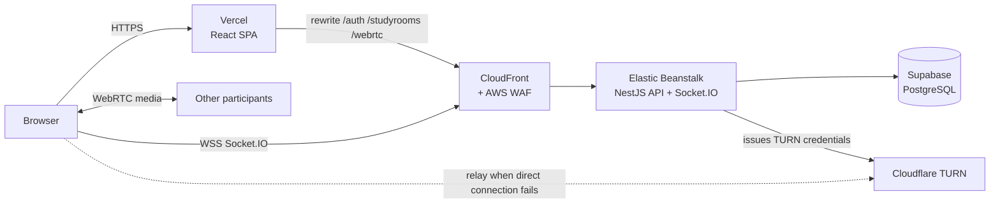

# Moremore On — Frontend

**English** | [한국어](README.ko.md)

Moremore On is a group study app with video and voice study rooms, real-time chat, and invite links. This repository is the React client. The API lives in [moremore-backend](https://github.com/HyeseongO/moremore-backend).

**Live demo:** https://moremore-frontend.vercel.app

No sign-up needed: click **Demo 1** on the login page. To try a call, create a room with Demo 1, copy the invite link, and open it in a second browser (or a private window) logged in as **Demo 2**. Demo accounts are read-only in Settings, so they stay usable for everyone.


## Screenshots

| Study rooms | Video room |
| --- | --- |
|  |  |
| **Chat with typing indicator** | **Settings: devices and account** |
|  |  |

The whole UI, including server error messages, switches between English and Korean:


## Features

- **Accounts**: email sign-up and Google sign-in, logout, multi-device sessions
- **Study rooms**: create rooms, join with an invite link or code, host badge, live online count
- **Video and voice**: small rooms are video calls for up to 4 people, large rooms are voice-only for up to 12
- **In-room controls**: mute and camera toggles, with mute and camera-off indicators that stay in sync for people who join later
- **Chat**: persisted messages, history on join, typing indicator, localized timestamps
- **Settings**: change nickname or password, delete account, choose camera and microphone with a live preview and mic level meter
- **English and Korean**: detected from the browser, switchable anywhere, remembered per browser

## Architecture



## Tech stack

React 19 · TypeScript · Vite 7 · Tailwind CSS · React Router 7 · Socket.IO client 4 · WebRTC · react-i18next · Axios · lucide-react

## Engineering highlights

**First-party cookies across a split deployment.** The SPA runs on Vercel and the API on AWS. Vercel rewrites `/auth`, `/studyrooms`, and `/webrtc` to CloudFront, so auth cookies stay first-party (`HttpOnly`, `SameSite=Lax`) and are never readable from JavaScript. WebSockets can't go through that rewrite, so the client fetches a one-minute socket token over HTTPS and connects to CloudFront directly.

**WebRTC that connects on real networks.** Rooms use a mesh topology. Only the newcomer creates offers, which avoids offer collisions (glare). ICE candidates that arrive early are queued until the remote description is set. The API issues Cloudflare TURN credentials, so calls still connect behind strict NATs. Mute and camera state is re-announced whenever someone joins, so late joiners see the right indicators without any server-side state.

**Found and fixed a refresh-token bypass.** Refresh tokens were stored as bcrypt hashes, but bcrypt only reads the first 72 bytes, and the first 72 bytes of a JWT are the same for every token of a user. Any old refresh token passed. Tokens are now stored as SHA-256 hashes in a per-device session table, and rotation is a conditional update, so two simultaneous refreshes can't both win. On the client, concurrent 401 responses share a single refresh request. Before: opening the main page after the access token expired fired 4 refresh calls and forced a logout. After: 1 call, and the page stays signed in.

**13× lighter first load.** A 2.1 MB "SVG" that actually embedded a base64 PNG was bundled into the JavaScript. It is now an 11 KB AVIF with a 40 KB JPEG fallback, and routes are lazy-loaded. Initial transfer went from 1.73 MB to 136 KB. On a throttled 1.6 Mbps connection, the login screen is ready in 1.0 s instead of 8.9 s.

**Bilingual down to the error messages.** The server returns machine-readable error codes (for example `INVALID_INVITE_CODE`), and the client maps them to the selected language. Dates and times are formatted with the selected locale.

## Project structure

```
src/
├── components/   UI pieces (room list, modals, chat, media tiles and controls, settings sections)
├── hooks/        useWebRTC (peer connections, media, mute state), useLogout
├── i18n/         i18next setup and the ko / en message files
├── pages/        Login, SignUp, GoogleSignup, Main, Room, Settings, Privacy, JoinStudyRoom
├── services/     Axios instance with single-flight refresh, Socket.IO client, API calls
└── utils/        validation rules, API error translation, saved media devices
```

## Running locally

Start the [backend](https://github.com/HyeseongO/moremore-backend) first (it listens on the `PORT` you set, for example `8000`, and must allow `http://localhost:5173` as `FRONTEND_URL`).

```bash
npm install
cp .env.example .env
npm run dev
```

Open http://localhost:5173.

| Variable | Purpose |
| --- | --- |
| `VITE_API_URL` | API base URL for local development, for example `http://localhost:8000`. Leave empty in production, where Vercel rewrites API paths. |
| `VITE_SOCKET_URL` | Socket.IO URL. Defaults to `VITE_API_URL`; in production it points to CloudFront. |
| `VITE_DEMO_EMAIL_1`, `VITE_DEMO_PASSWORD_1`, `VITE_DEMO_EMAIL_2`, `VITE_DEMO_PASSWORD_2` | Optional. When set, the login page shows Demo buttons. |

Other scripts: `npm run build`, `npm run lint`, `npm run preview`.

## Related

- Backend: [HyeseongO/moremore-backend](https://github.com/HyeseongO/moremore-backend)
- Built by [@HyeseongO](https://github.com/HyeseongO)
